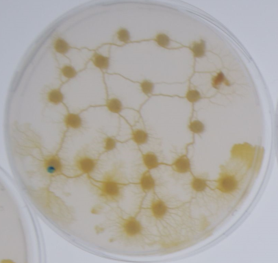
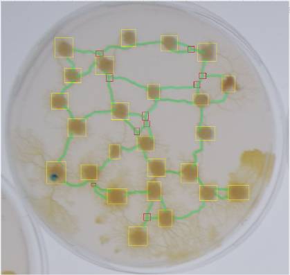
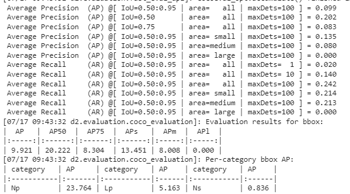
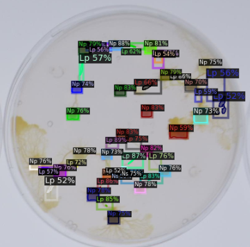
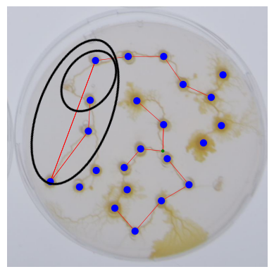
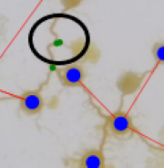

# Blob detectron inference

This project was conducted as part of an internship as Data Scientist at LABSOFT during my engineering studies.

The project's goal is to develop a tool for automatically detecting and simulating the network created by the Physarum polycephalum (blob) from an input image.

CNRS conducts experiments with the blob in petri dishes and captures photographs.

 

To achieve this, we define three distinct classes:

- Main Nodes (Np): Attraction points, often oat flakes.
- Links (Lp): The path traveled by the blob between two nodes.
- Secondary Nodes (Ns): Crossroads between multiple links.
  
To automatically detect the various elements in an image, we employ a machine learning object detection model. 
We then process the identified data in a script to obtain a JSON file containing the position information of the different objects..  

# Model Training (Blob_training.ipynb) 

The dataset consists of 192 images of petri dishes, annotated using the Supervisely tool

  

Annotations are exported in the COCO format and split into training data "physarum_train" (80%) and test data "physarum_test" (20%).

We chose the Mask R-CNN model, an extension of Faster R-CNN, which utilizes the Detectron2 API.

The model training is conducted in the Blob_training.ipynb notebook.

Faster R-CNN is a neural network that operates in two stages. First, it identifies regions of interest and then passes them to a convolutional neural network. The output results are fed into a Support Vector Machine (SVM) for classification. Subsequently, regression is performed to adjust the predicted bounding box to the exact position and size of the real object within the region of interest.

Mask R-CNN is capable of both object detection and semantic segmentation of the detected instances, allowing us to obtain masks for the detected objects rather than simple bounding boxes.

## Model Training Settings :  

To accelerate training and improve model performance, the initial network weights are loaded from the pre-trained "R-50.pkl" model on ImageNet.

cfg.SOLVER.IMS_PER_BATCH = 4 sets the number of images used for each gradient update. A larger batch size allows for better GPU resource utilization, speeding up training.

The model is trained for cfg.SOLVER.MAX_ITER = 3000 iterations. The number of iterations controls the training duration and allows the model to converge to an optimal solution.

Batch size per image: The parameter cfg.MODEL.ROI_HEADS.BATCH_SIZE_PER_IMAGE = 8 specifies the number of region proposals (ROI) for each training image.

Detection score threshold: The detection score threshold is set to cfg.MODEL.ROI_HEADS.SCORE_THRESH_TEST = 0.45, meaning that only detections with a score greater than 0.45 are considered during inference.

## Model Performance Metrics

To assess model performance, we visualize certain performance metrics:

We evaluate the model's performance :  
- Average Precision : eby comparing its predictions to the ground truth annotations at various Intersection over Union (IoU) threshold values (measuring the degree of overlap between the model's prediction and the actual annotation of an object).
- Average Recall : indicate what proportion of the objects actually present in the image were correctly detected by the model.

Additionally, we visualize the results to measure performance during adjustments:

  

# Script Operation :  

The Blob_detection.py script takes an image as input and outputs a JSON file containing the positions of the predicted objects.

To achieve this, the script comprises six functions :

## prediction(img_name, data_dir): 

This function predicts the objects present in the image and provides information about them.

Prediction is performed using the pre-trained model saved as a Torchscript model.

Params:

    - img_name: The filename of the image to be detected.
    - data_dir: The path to the directory containing the script.

Returns:

    - outputs: A variable containing prediction information.
    - img: The input image.

During the process, the image is converted from RGB (Red Green Blue) to BGR to ensure correct model operation.

## extractionOutputs(outputs): 

This function extracts data about the predicted objects and places them in lists.

Params:

    - outputs: A variable containing prediction information.
  
Returns:

    - noeuds: A list of detected nodes.
    - positions: A dictionary containing the positions (x, y) of each node.
    - positionLiens: A dictionary containing the positions (x, y) of each link.
  
The function iterates through the outputs variable, takes the first tensor (output[0][i]) containing prediction boxes, and determines the object positions by calculating the center of each box.

It checks the predicted class (pred_class) to place the object in the correct list. 

For secondary nodes, it ensures that no other node is within a distance of 6, as the model may detect two secondary nodes in the same location.

## detectionLiens(positions, positionLiens, seuil, marge): 

This function detects whether a link exists between two nodes using the previously generated lists.

Params:

    - positions: A dictionary containing the positions (x, y) of each node.
    - positionLiens: A dictionary containing the positions (x, y) of each link.
    - seuil: The threshold for link detection.
    - marge: A margin for positioning the link.
  
Returns:

    - listeLiensFinal: A list of detected links between two nodes, composed of node tuples.
    
A double loop iterates through the node list, draws a line between each pair of nodes, and then goes through the link list. 
It calculates the distance between the link and the line, considering the link present between two nodes if the distance is less than the "threshold".

Furthermore, it checks that the x and y coordinates of the link fall within the x and y coordinates of the nodes (with a "marge"). 

It then checks for any pairs of nodes connected by a link if there is a pair of nodes closer to each other.

## drawGraph(nœuds, positions, listeLiensFinal): 

This function creates a NetworkX graph from the lists of nodes and links.

Params:

    - noeuds: A list of nodes.
    - positions: A dictionary containing the positions (x, y) of each node.
    - listeLiensFinal: A list of node pairs connected by links.

## conversionBlobRecorder(image,graph,positions,echelle,img_name): 

This function converts the NetworkX graph into JSON format that can be used with the Blob Recorder tool.

Params:

    - image: The original image.
    - graph: The NetworkX graph.
    - positions: The dictionary containing the positions of different nodes.
    - echelle: A scale to match the Blob Recorder image format.
    - img_name: The name of the image.
  
The function iterates through the node and link lists, entering the values into a dictionary in the format expected by Blob Recorder. 

It then saves the result in a JSON file with the same name as the image.

## blobDetection(img_name, data_dir): 

This final function allows running the other functions.

Params:

    - img_name: The name of the image to detect.
    - data_dir: The directory path where the files are located.
 

# Limitations/Challenges Encountered

At times, the blob creates a link with excessive curvature, and the detectionLiens() function uses its center to detect its presence, which can lead to errors. This is where the "threshold" and "margin" parameters come into play, but they may not always suffice: 

There are instances where the model detects two secondary nodes stuck together instead of one. This issue has been addressed in post-processing within the extractionOutputs() function : 

Please note that for confidentiality reasons, the model and the training images are not available on this GitHub repository. If you wish to access the images, you can contact the following addresses: y.boudi@labsoft.fr or j.otando@labsoft.fr.

