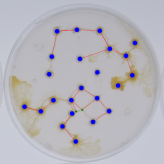

# Blob detectron inference

This project was conducted as part of an internship as Data Scientist at LABSOFT during my engineering studies.

The project's goal is to develop a tool for automatically detecting and simulating the network created by the Physarum polycephalum (blob) from an input image.

CNRS conducts experiments with the blob in petri dishes and captures photographs.

 

To achieve this, we define three distinct classes:

- Main Nodes (Np): Attraction points, often oat flakes.
- Links (Lp): The path traveled by the blob between two nodes.
- Secondary Nodes (Ns): Crossroads between multiple links.
  
To automatically detect the various elements in an image, we employ a machine learning object detection model. 
We then process the identified data in a script to obtain a JSON file containing the position information of the different objects..  

# Entrainement du modèle (Blob_training.ipynb) 

The dataset consists of 192 images of petri dishes, annotated using the Supervisely tool

  

Annotations are exported in the COCO format and split into training data "physarum_train" (80%) and test data "physarum_test" (20%).

We chose the Mask R-CNN model, an extension of Faster R-CNN, which utilizes the Detectron2 API.

The model training is conducted in the Blob_training.ipynb notebook.

Faster R-CNN is a neural network that operates in two stages. First, it identifies regions of interest and then passes them to a convolutional neural network. The output results are fed into a Support Vector Machine (SVM) for classification. Subsequently, regression is performed to adjust the predicted bounding box to the exact position and size of the real object within the region of interest.

Mask R-CNN is capable of both object detection and semantic segmentation of the detected instances, allowing us to obtain masks for the detected objects rather than simple bounding boxes.

## Model Training Settings :  

To accelerate training and improve model performance, the initial network weights are loaded from the pre-trained "R-50.pkl" model on ImageNet.

cfg.SOLVER.IMS_PER_BATCH = 4 sets the number of images used for each gradient update. A larger batch size allows for better GPU resource utilization, speeding up training.

The model is trained for cfg.SOLVER.MAX_ITER = 3000 iterations. The number of iterations controls the training duration and allows the model to converge to an optimal solution.

Batch size per image: The parameter cfg.MODEL.ROI_HEADS.BATCH_SIZE_PER_IMAGE = 8 specifies the number of region proposals (ROI) for each training image.

Detection score threshold: The detection score threshold is set to cfg.MODEL.ROI_HEADS.SCORE_THRESH_TEST = 0.45, meaning that only detections with a score greater than 0.45 are considered during inference.

## Model Performance Metrics

To assess model performance, we visualize certain performance metrics:

We evaluate the model's performance :  
- Average Precision : eby comparing its predictions to the ground truth annotations at various Intersection over Union (IoU) threshold values (measuring the degree of overlap between the model's prediction and the actual annotation of an object).
- Average Recall : indicate what proportion of the objects actually present in the image were correctly detected by the model.

Additionally, we visualize the results to measure performance during adjustments:

  

# Script Operation :  

The Blob_detection.py script takes an image as input and outputs a JSON file containing the positions of the predicted objects.

To achieve this, the script comprises six functions :

## prediction(img_name, data_dir): 

This function predicts the objects present in the image and provides information about them.

Prediction is performed using the pre-trained model saved as a Torchscript model.

Params:

- img_name: The filename of the image to be detected.
- data_dir: The path to the directory containing the script.

Returns:

- outputs: A variable containing prediction information.
- img: The input image.

During the process, the image is converted from RGB (Red Green Blue) to BGR to ensure correct model operation.

## extractionOutputs(outputs): 

Cette fonction extrait les données des ojbets prédits et les places dans des listes. 

Params :  
    
    - outputs : variable qui contient les informations des prédictions. 

Returns : 
   
    - nœuds : liste des nœuds détectés. 

    - positions : dictionnaire contenant les positions (x,y) de chaque nœud. 

    - positionLiens : dictionnaire contenant les positions (x,y) de chaque lien. 

La fonction parcourt la variable output, prend le premier tensor (output[0][i]) qui contient les box de prédictions. 

On prend le centre de chaque boite pour identifier la position des objets.  

On vérifie la classe prédite (pred_class) afin de placer l’objet dans la bonne liste. 

Pour les nœuds secondaires, on vérifie qu’aucun autre nœud ne se situe à moins de 6, car il arrive au modèle de détecter deux nœuds secondaires au même endroit. 

## detectionLiens(positions, positionLiens, seuil, marge): 

Cette fonction détecte si un lien est présent entre deux nœuds à l’aide des listes précédemment produites. 

Params : 
   
    - positions : dictionnaire contenant les positions (x,y) de chaque nœud. 

    - positionLiens : dictionnaire contenant les positions (x,y) de chaque lien. 

Returns :  
   
    - listeLiensFinal : liste des liens détectés entre deux nœuds, composés de tuples de nœuds. 

Une double boucle parcourt la liste de nœuds, trace une droite entre chaque paire de nœuds, puis parcourt la liste de liens. On calcule la distance entre le lien et la droite, si elle est inférieure au “seuil”, on considère que le lien est prédsent entre deux nœuds.  

De plus, on vérifie que les x et y du lien, sont placés entre les x et y des nœuds (avec une “marge”). 

Ensuite, on parcourt nos résultats, pour chaque paire de nœuds reliée par un lien, on vérifie qu’il n’existe pas une paire de nœuds plus rapprochés.  

## drawGraph(nœuds, positions, listeLiensFinal): 

Cette fonction crée un graphe NetworkX à partir des listes de nœuds et de liens. 

Params : 
   
    - nœuds:  liste des nœuds. 

    - positions : dictionnaire contenant les positions (x,y) de chaque nœud. 

    - listeLiensFinal: Liste des paires de nœuds connectés par des liens. 

## conversionBlobRecorder(image,graph,positions,echelle,img_name): 

Cette fonction converti le graphe NetworkX en JSON exploitable par l’outil Blob Recorder. 

Params :  
   
    - image: c’est l’image d’origine. 

    - graph: le graphe NetworkX. 

    - positions: le dictionnaire contennant les positions des différents nœuds. 

    - echelle: une echelle pour convenir au format d’image de Blob Recorder.  

    - img_name: le nom de l’image 

La fonction parcourt les listes de nœuds et liens, pour rentrer les valeurs dans un dictionnaire au format attendu par Blob Recorder. 

Ensuite elle enregistre le résultat dans un fichier JSON au même nom que l’image. 

## blobDetection(img_name, data_dir): 

Cette dernière fonction permet de lancer les autres fonctions.  

Params : 
   
    - img_name : le nom de l’image à détecter. 
    
    - data_dir : le chemin du répertoire ou se trouvent les fichiers. 

 

# Limites/Problèmes rencontrés

Quelques fois, le blob trace un lien avec une trop forte courbure, et la fonction detectionLiens() utilise son centre pour détecter sa présence, ce qui peut amener à des erreurs, c'est à ca que servent "seuil" et "marge", mais cela ne suffit pas toujours : 

Il arrive que le modèle détecte 2 Noeuds secondaires collés l'un à l'autre au lieu d'un seul. Ce problème a été réglé en post-traitement dans extractionOutputs() : 

